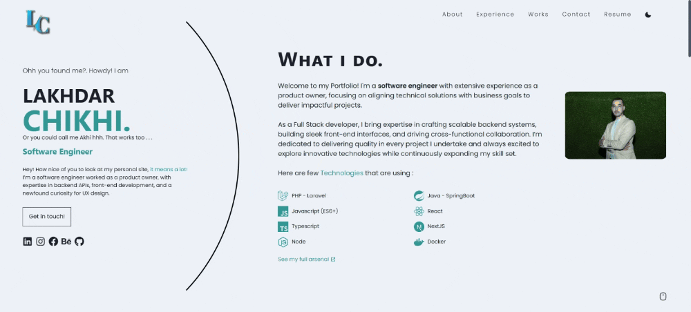

# Lakhdar CHIKHI's Personal Portfolio  

Welcome to version 1 of my portfolio site! I created this project as an opportunity to explore and refine my skills in UI and UX design. Building my portfolio from the ground up allowed me to experiment and showcase my capabilities.  

This portfolio is developed using TypeScript and [Next.js](https://nextjs.org/) as a Static Site Generation (SSG) framework. It leverages [Chakra UI](https://chakra-ui.com/) for styling and [Framer Motion](https://www.framer.com/motion/) for animations, ensuring a modern and dynamic user experience.  

Currently, the site highlights key details about me, and I plan to expand its functionality in the future to include a personal blog.  

The site is hosted on **Vercel's** free tier.

## Build Status  

[](https://vercel.com/Lakhdar-CHIKHI/portfolio)


## Demo




## Local Development

This is just a [Next.js](https://nextjs.org/) project bootstrapped with [`create-next-app`](https://github.com/vercel/next.js/tree/canary/packages/create-next-app).

Please use atleast Node v12, but the recommended version is Node v14 LTS. There's a `.nvmrc`, you can run `nvm use` if you have nvm installed.

## Getting Started

This project heavily favors <b>yarn</b> over npm. 

So to set things up you need to run

```bash
yarn install
```
or just
```bash
yarn
```

Then to run the development server:

```bash
yarn dev
```

and it should open at

> http://localhost:3000/


## Deployment

This portfolio is deployed using [Vercel](https://vercel.com). Any changes merged into the `master` branch are automatically deployed. Simply merge your feature branch (e.g., `feat/*`) into `master`, and the deployment will be handled seamlessly by Vercel.

## Credits  

Made with love ❤️ and 🥣 soup.  

